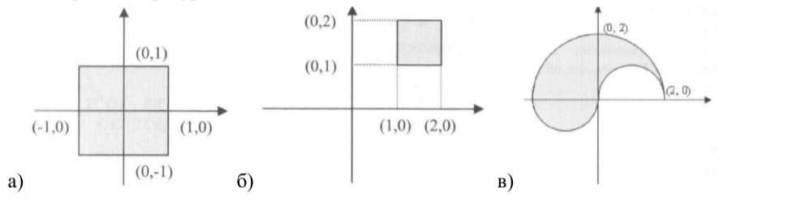
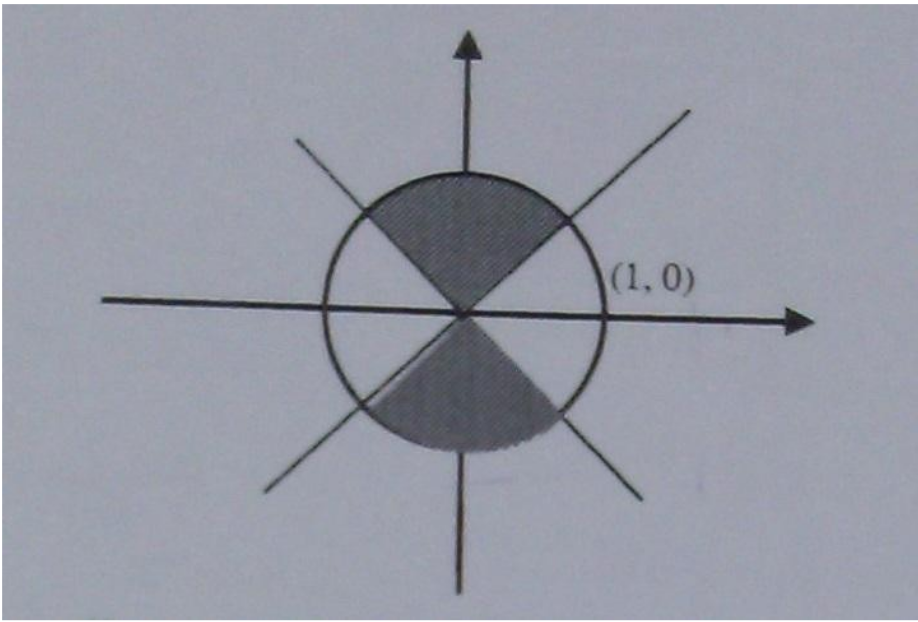
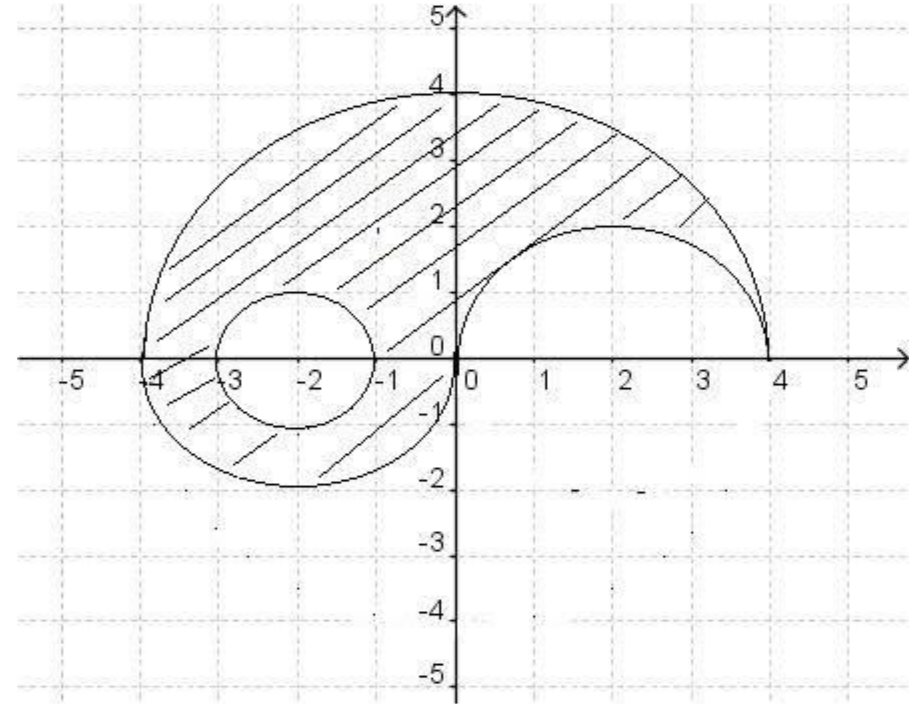

# Задача 1

Да се напише програма, която въвежда три числа и извежда най-голямото от тях.

**Example 1:**

```c++
Input: 3 1 7
Output: 7
```

# Задача 2

Да се напише програма, която въвежда две числа `n` и `m` (n е трицифрено, а m е едноцифрено). Да се изведе на конзолата `true`, ако `m` се съдържа в `n` и `false` в противен случай.

**Example 1:**

```c++
Input: n = 341, m = 4
Output: true
```

**Example 2:**

```c++
Input: n = 568, m = 9
Output: false
```

# Задача 3

Да се напише програма, която проверява дали трицифрено число `n` има повтарящи се цифри или не и извежда подходящо съобщение.

Да се изведат позициите на повтарящите се цифри.

**Example 1:**

```c++
Input: n = 341
Output: There are no repeating digits.
```

**Example 2:**

```c++
Input: n = 131
Output: The first and third digit are repeating.
```

# Задача 4

Да се напише програма, която извежда `true`, ако цифрите на трицифрено число `n` са подредени във възходящ ред и `false` – в противен случай.

**Example 1:**

```c++
Input: n = 123
Output: true
```

**Example 2:**

```c++
Input: n = 132
Output: false
```

# Задача 5

Да се напише програма, която въвежда число `n`. Ако то не е в интервала `[1001, 8888)` да се отпечата съобщение за грешка. Ако е в този интервал, да се въведе едноцифреното число `m` и да се изведе колко пъти `m` се съдържа във въведеното число.

**Example 1:**

```c++
Input: n = 8888
Output: Error message
```

**Example 2:**

```c++
Input: n = 1001, m = 1
Output: 2
```

# Задача 6

Дадено е цяло петцифрено число `x`, изведете true ако `x` е палиндром.

Цяло число е **палиндром** ако се чете по един и същи начин отпред назад и отзад напред. Например `121` е палиндром, докато `123` не е.

**Example 1:**

```c++
Input: n = 12021
Output: true
```

**Example 2:**

```c++
Input: n = 12341
Output: false
```

**Example 3:**

```c++
Input: n = -10301
Output: false
Explanation: -10301 reversed is 10301-
```

# Задача 7

В училище следната система за оценяване е налице:

```
Под 25 - 2.00
25 до 40 - 3.00
40 до 60 - 4.00
60 до 80 - 5.00
Над 80 - 6.00
```

По дадени точки `n` изведете оценката.

**Example 1:**

```c++
Input: n = 45
Output: 4.00
```

**Example 2:**

```c++
Input: n = 99
Output: 6.00
```

**Example 3:**

```c++
Input: n = -15
Output: Error message
```

# Задача 8

Дадени са ви три числа `a`, `b`, `c`. Определете дали те могат да са страни на триъгълник

**Example 1:**

```c++
Input: a = 2, b = 3, c = 4
Output: true
```

<details><summary><b>Hint 1</b></summary>
<p>


</p>
</details>
<br>

# Задача 9

Да се напише програма, която въвежда символ `c` и извежда съобщение на екрана дали символът е малка буква, главна буква, цифра или друг символ.

**Example 1:**

```c++
Input: c = 'a'
Output: Small letter
```

**Example 2:**

```c++
Input: c = 'B'
Output: Capital letter
```

**Example 3:**

```c++
Input: c = '5'
Output: Digit
```

**Example 4:**

```c++
Input: c = '@'
Output: Other
```

# Задача 10

Да се напише програма, която въвежда буква и извежда съответната ѝ главна буква и кода ѝ от ASCII таблицата.

**Example 1:**

```c++
Input: c = 'a'
Output: A
```

**Example 2:**

```c++
Input: c = 'B'
Output: B
```

**Example 3:**

```c++
Input: c = '-'
Output: Invalid input
```

# Задача 11

Един кръг се определя по център - точка с координати `x` и `y` и радиус `r`. Дадени са два кръга: `x1`, `y1`, `r1` и `x2`, `y2`, `r2`. Да се определи дали те са:

- докосващи се
- без общи точки
- пресичащи се
- една и съща окръжност

**Example 1:**

```c++
Input: x1 = -10, y1 = 8, x2 = 14, y2 = -24, r1 = 30, r2 = 10
Output: Circle touch each other.
```

<details><summary><b>Hint 1</b></summary>
<p>

Не забравяйте, че координатите на точка могат да са дробни числа.

</p>
</details>
<br>

# Switch and Enums FAQ

Как използваме `switch`?

```c++
int n = 5;
switch (n) {
    case 5:
        // do something ...
        break;
    case 6:
        // do something ...
        break;
    case 10 ... 20:
         // do something ...
        break;
    default:
        // do something else ...
}
```

Как използваме `enum`?

```c++
// Sunny = 0, Windy = 1, Cloudy = 2
enum WeatherType { Sunny, Windy, Cloudy };
enum WeekDays { Sun = 7, Mon = 1, Thu, ... };
// Win = 1, Lose = 10, Draw = 11
enum GameResult { Win = 1, Lose = 10, Draw };
```

# Задача 12

Напишете програма, в която потребителя въвежда число `n`, след което на екрана се изписва това число на кой месец от годината съответства.

**Example 1:**

```c++
Input: 5
Output: May
```

# Задача 13

Да се напише програма, която приема две цели числа `n` и `m` и един от символите `+`, `-`, `*`, `/` или `%`. Ако символът, който е въведен е един от тях, да се извърши съответната операция върху двете числа. В противен случай да се изведе съобщение за невалиден символ.

**Example 1:**

```c++
Input: n = 5, m = 12, op = '-'
Output: -7
```

**Example 2:**

```c++
Input: n = 1, m = 2, op = '*'
Output: -2
```

**Example 3:**

```c++
Input: n = 5, m = 12, op = '@'
Output: Error message
```

**Example 4:**

```c++
Input: n = 1, m = 0, op = '/'
Output: Division by zero
```

# Задача 14

По дадени:

- ден и номер на месец от годината да се изведете зодията на човек.
- число – пореден номер на зодия, като се започва от 1-ви номер за Козирог и завършва с последен 12-ти за Стрелец да се изведат дните, в които е зодията.

**Example 1:**

```c++
Input: day = 7, month = 5
Output: Taurus
```

**Example 2:**

```c++
Input: sign = 5
Output: Apr 20 - May 20
```

# Задача 15

Напишете програма, в която потребителя въвежда числa `n`, `k`, `m`, `y`, където n e ден от месец, k е ден от седмицата, m е месец и y е година и извежда датата в посочения формат: DD/EE/Mon/YYYY

**Example 1:**

```c++
Input: 15 4 6 2005
Output: 15 Thu Jun 2005
```

**Constraints:**

- `1 <= n <= 31`
- `1 <= k <= 7`
- `1 <= m <= 12`
- `y > 0`

# Задача 16

Даден е правоъгълник, зададен по координатите на точки на долния ляв `lx` и `ly` и горния десен ъгъл `rx` и `ry`. Да се напише програма, която по зададени координати на точка `x` и `y`, определя дали тя принадлежи на вътрешността на правоъгълника (заедно с контура).

**Example 1:**

```c++
Input: bottomLeft = (0, 0), topRight = (2, 2), point = (1.53, 2)
Output: Inside
```

**Example 2:**

```c++
Input: bottomLeft = (0, 0), topRight = (2, 2), point = (-5, -1.53)
Output: Outside
```

**Example 3:**

```c++
Input: bottomLeft = (3, 3), topRight = (2, 2), point = (1.53, 2)
Output: Invalid input
```

# Задача 17

Да се напише програма, която проверява дали въведена от клавиатурата точка скоординати x и y принадлежи на защрихованата част от чертежа. След като проверката е направена, да се изведе подходящ текст.



**Example 1:**

```c++
Input: pointA = (0.5, 0.5), pointB = (1.5, 1.5), pointC = (-1, -1)
Output: Inside Inside Inside
```

А дали принадлежи на тези фигури?



